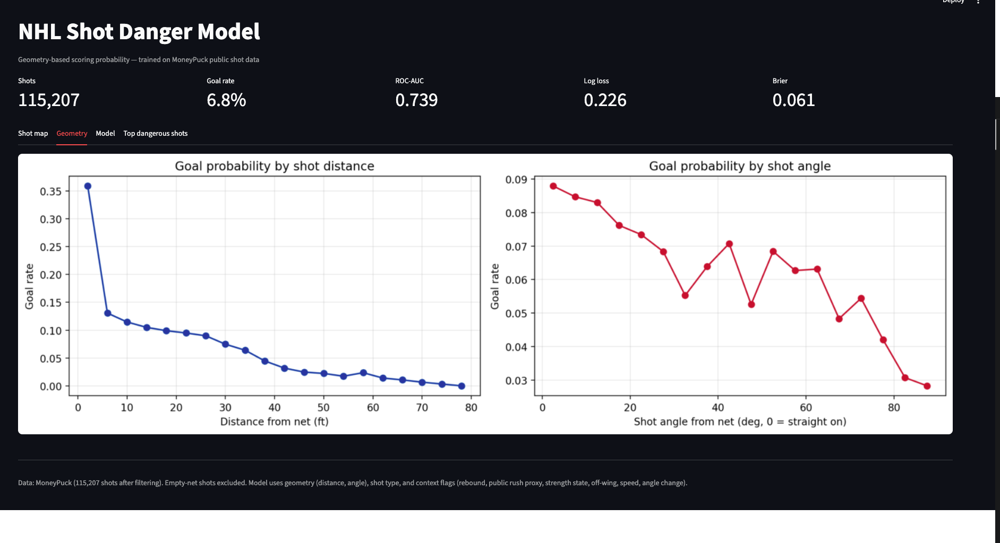
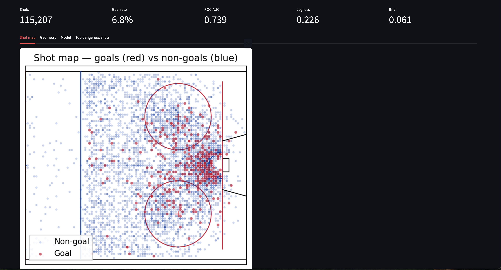

# NHL Shot Danger Model: Geometry-Based Expected Goals

A geometry-based expected-goals model for NHL shots, built around public [MoneyPuck shot data](https://moneypuck.com/data.htm). The project turns each shot into a scoring-probability estimate, evaluates the probabilities with proper rare-event metrics, and translates the output into a Streamlit dashboard plus coach-facing reports.

This project is designed as a compact end-to-end hockey analytics workflow: real CSV ingestion, hockey-specific feature engineering, interpretable modeling, evaluation, visualization, and non-technical communication.

## What It Demonstrates

- Robust loading for MoneyPuck-style shot CSVs with clear validation errors.
- Geometry features: distance, angle, non-linear transforms, and location heatmaps.
- Hockey context: shot type, rebound flags, public rush proxy, strength state, score state, off-wing shots, event speed, rebound angle change, and shooter position when available.
- An interpretable logistic-regression xG baseline with coefficients a coach or analyst can reason about.
- Evaluation with ROC-AUC, log loss, Brier score, and calibration instead of misleading accuracy.
- Optional benchmarking against MoneyPuck's published `xGoal` column when it exists in the data.
- A Tampa Bay Lightning example section for team-level comparison using public data.



*Figure 1. Geometry Page.*


*Figure 2. Shot Map .*

## Data

MoneyPuck makes NHL shot-level CSV files available for non-commercial/public analysis. The shot files include saved shots, missed shots, goals, adjusted coordinates, game context, and model probabilities such as `xGoal`.

Start with one completed season:

```bash
cd data
curl -LO https://peter-tanner.com/moneypuck/downloads/shots_2024.zip
unzip shots_2024.zip
mv shots_2024.csv shots.csv
cd ..
```

MoneyPuck also provides current-season shot data when available. Use the exact link shown on their data page if you want the latest in-season file.

The repository includes `data/sample_shots.csv` only as a synthetic fallback so the pipeline can be tested without downloading data. Do not use synthetic metrics as NHL conclusions.

## Quickstart

```bash
python -m venv .venv
source .venv/bin/activate
python -m pip install -r requirements.txt

# Optional: regenerate the synthetic demo file
python make_sample_data.py

# Run the dashboard
streamlit run app.py
```

Notebook walkthrough:

```bash
jupyter notebook notebooks/01_shot_danger_model.ipynb
```

## Repo Layout

```text
hockey-shot-danger-model/
  app.py
  make_sample_data.py
  README.md
  DATA_INSTRUCTIONS.md
  requirements.txt
  data/
    sample_shots.csv
  docs/
    screenshots/
  notebooks/
    01_shot_danger_model.ipynb
  reports/
    coach_summary.md
    lightning_example_summary.md
  src/
    features.py
    model.py
    visuals.py
```

## Modeling Approach

The baseline model is logistic regression. That is a deliberate choice: xG is a probability problem, and a simple calibrated model is easier to inspect than a black-box model. The notebook also includes a gradient-boosted comparison, but the main story is interpretability plus honest probability evaluation.

Accuracy is not a primary metric. Goals are rare, so a model that predicts "no goal" for almost every shot can look accurate while being useless for expected goals. This project reports:

- **ROC-AUC:** how well the model ranks more dangerous shots above less dangerous shots.
- **Log loss:** whether the predicted probabilities are confident for the right reasons.
- **Brier score:** average squared probability error.
- **Calibration:** whether shots predicted around 10% actually score around 10% over a large enough sample.

If MoneyPuck `xGoal` is present, the notebook compares this model to MoneyPuck on the same held-out rows. The benchmark is used as a reference point for calibration and ranking quality, not as a claim that this compact model replaces a production xG model.

A 0.5 classification threshold is not emphasized because goal prediction is a rare-event probability problem. Most useful xG probabilities are far below 50%, so calibration, Brier score, log loss, and ROC-AUC are more meaningful than accuracy or a default confusion matrix.

## Verified 2025 Run

On the 2025 MoneyPuck shot file used for the portfolio validation pass, the project loaded 116,207 raw shots, removed 1,000 empty-net shots, and modeled 115,207 shots with a 6.82% goal rate.

| Model | ROC-AUC | Log loss | Brier |
|---|---:|---:|---:|
| Project logistic baseline | 0.7395 | 0.2259 | 0.0607 |
| MoneyPuck `xGoal` | 0.7694 | 0.2178 | 0.0587 |

The project model trails MoneyPuck's published `xGoal` benchmark, but performs reasonably as a transparent geometry-based baseline and is easier to explain through coefficients, calibration, and coach-facing visuals.

## Tampa Bay Example

The notebook contains a Tampa Bay Lightning section that runs when a team column exists and `TBL` appears in the data. It compares Tampa Bay's average predicted shot danger, high-danger shot share, distance/angle profile, rebound share, and public rush-proxy share against the rest of the league. The companion writeup is [reports/lightning_example_summary.md](reports/lightning_example_summary.md).

In the 2025 MoneyPuck shot dataset, Tampa Bay generated slightly higher shot danger per shot than the rest of the league: about +0.003 to +0.004 xG per shot depending on whether using the project model or MoneyPuck's published `xGoal`. This is public-data analysis, not proprietary team insight or a full team evaluation.

## Coach-Facing Report

[reports/coach_summary.md](reports/coach_summary.md) summarizes the model in plain English:

- one-paragraph overview
- three key findings
- three tactical recommendations
- limitations
- next steps with private tracking data


## Limitations

- Public shot data does not include private tracking features such as screens, defender pressure, or goalie lateral movement.
- Coordinates and event labels are post-game public data, not a substitute for video review.
- The sample dataset is synthetic and exists only for smoke testing.
- The public `shotRush` flag is sparse in the 2025 file, so rush-related results should be treated as a rough proxy rather than a complete transition-offense measure.
